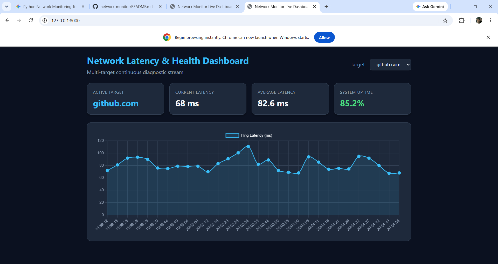

# Real-Time Network Observability & Diagnostic Suite



A multi-threaded, asynchronous network monitoring daemon and diagnostic engine built with Python, FastAPI, SQLite, and Chart.js.

## Features

- **Concurrent TCP Handshake Scanner:** Non-blocking multi-threaded probe checking port status and connection latency.
- **DNS Records Inspector:** Full resolution for `A`, `AAAA`, `MX`, `NS`, and `TXT` records with per-query timing.
- **ICMP Ping Diagnostics Engine:** Raw ping orchestration measuring min/avg/max RTT, packet loss percentage, and jitter (latency variance).
- **Interface Bandwidth Telemetry:** Real-time RX/TX throughput tracking per network adapter using `psutil`.
- **Persistent Time-Series Database:** Automated background metric logging and uptime aggregation using SQLite.
- **Multi-Target Live Web Dashboard:** Responsive dark-mode dashboard powered by FastAPI and Chart.js with dynamic target-switching.
- **Automated Incident Webhook Alerts:** Real-time alert notifications dispatched on packet loss or connection drops.

---

## Project Structure

```text
├── alerter.py             # Incident alerting via webhooks
├── continuous_watch.py    # Background polling daemon (multi-target)
├── database.py            # SQLite schema, inserts, and aggregations
├── dns_probe.py           # DNS record resolution and query latency
├── monitor.py             # Unified CLI interface
├── net_stats.py           # Live adapter bandwidth throughput (KB/s)
├── ping_engine.py         # ICMP ping, jitter, and loss calculation
├── probe.py               # TCP 3-way handshake scanner
├── requirements.txt       # Pinned dependencies
└── server.py              # FastAPI server & real-time dashboard UI
